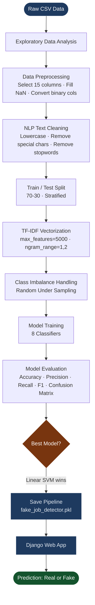
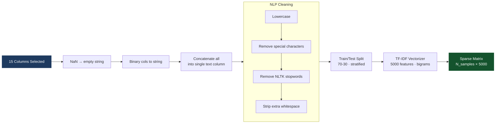
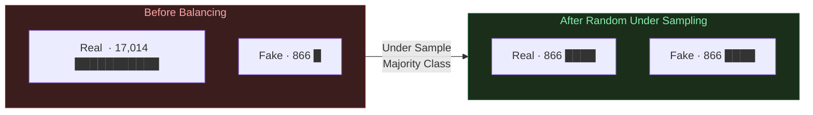
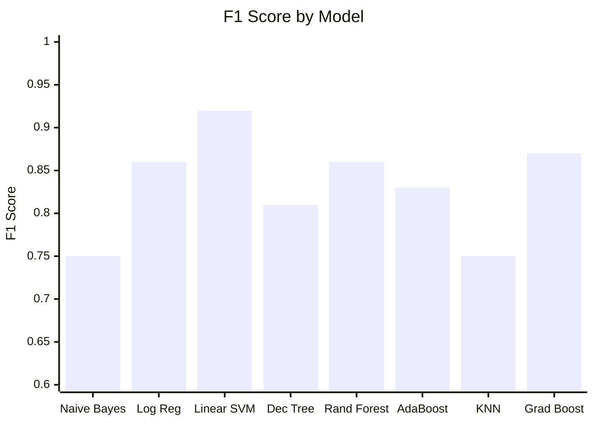
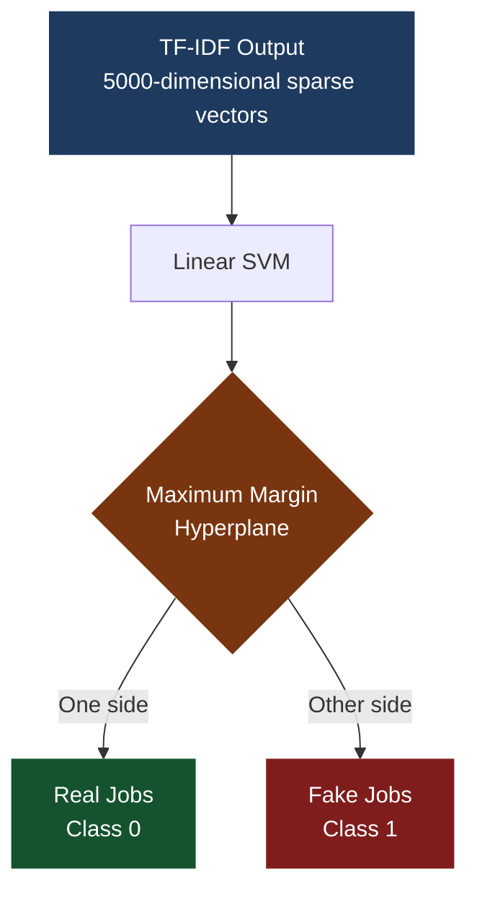
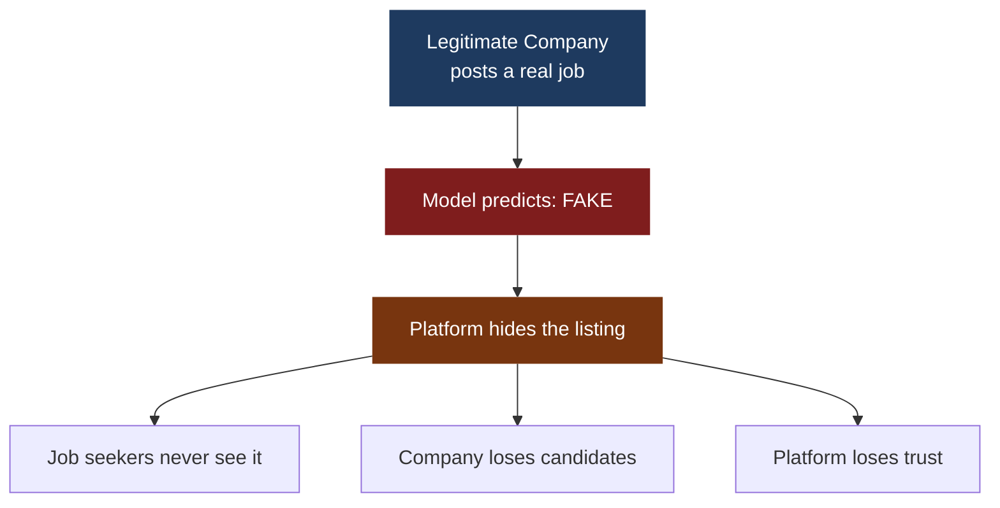
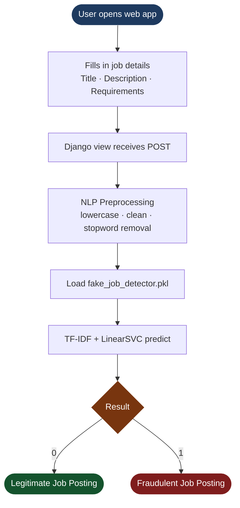

<div align="center">

<h1>Fake Job Detection System</h1>
<h3>ML + NLP Pipeline for Identifying Fraudulent Job Postings</h3>

<br/>


<br/>

> **B.Tech CSE (AI) — Final Year Project**  
> Pratyush Maurya &nbsp;|&nbsp; Kanpur University

<br/>

</div>

---

## Table of Contents

1. [Project Overview](#project-overview)
2. [Problem Statement](#problem-statement)
3. [Dataset Information](#dataset-information)
4. [Project Pipeline](#project-pipeline)
5. [EDA Highlights](#eda-highlights)
6. [Data Preprocessing](#data-preprocessing)
7. [Class Imbalance Handling](#class-imbalance-handling)
8. [Machine Learning Models](#machine-learning-models)
9. [Model Evaluation & Comparison](#model-evaluation--comparison)
10. [Best Model — Linear SVM](#best-model--linear-svm)
11. [Confusion Matrices](#confusion-matrices)
12. [Why False Positives Matter](#why-false-positives-matter)
13. [Model Saving & Deployment](#model-saving--deployment)
14. [Example Prediction](#example-prediction)
15. [Project Structure](#project-structure)
16. [Installation](#installation)
17. [Future Improvements](#future-improvements)
18. [Key Learnings](#key-learnings)

---

## Project Overview

Online job platforms have become easy targets for scammers who post fraudulent listings to steal personal data, demand upfront fees, or exploit desperate job seekers. The problem is large enough to be a real risk, yet subtle enough that manual filtering doesn't scale.

This project builds a complete, production-oriented ML + NLP pipeline that takes raw job posting data, extracts meaning from the text, and classifies each posting as real or fraudulent. The pipeline covers everything from raw CSV ingestion to a deployed Django web application.

<table>
<tr>
<td><strong>Prediction Labels</strong></td>
<td><code>0</code> = Legitimate Job &nbsp;|&nbsp; <code>1</code> = Fraudulent Job</td>
</tr>
<tr>
<td><strong>Best Model</strong></td>
<td>Linear SVM (LinearSVC) — 92% Accuracy, 0.92 F1 Score</td>
</tr>
<tr>
<td><strong>Deployment</strong></td>
<td>Django Web Application</td>
</tr>
</table>

---

## Problem Statement

Job seekers today face a genuine threat on most major platforms. A single fraudulent listing can lead to identity theft, financial loss, or worse. The gap this project fills is simple: catch fake postings automatically, before anyone applies.

```
Job Seekers
    |
    v
+----------------------------------+
|       Online Job Portal          |
|  +---------------+  +---------+  |
|  | Legitimate    |  |  Fake   |  |
|  | Postings      |  | Postings|  |
|  +---------------+  +---------+  |
+----------------------------------+
    |                    |
    v                    v
Safe Hiring         Data Theft / Scam
                    Money Fraud
                    Identity Theft
```

**Goal:** Automatically flag fraudulent job postings before a job seeker ever clicks apply.

---

## Dataset Information

<div align="center">

| Property | Details |
|:---|:---|
| Dataset Name | Fake Job Postings Dataset |
| Source | Kaggle |
| Total Rows | ~17,880 |
| Total Columns | 18 |
| Target Column | `fraudulent` |
| Class 0 | Legitimate Job Posting (~93%) |
| Class 1 | Fraudulent Job Posting (~7%) |

</div>

### Features Used

| # | Feature | Type |
|:---|:---|:---|
| 1 | `title` | Text |
| 2 | `location` | Text |
| 3 | `department` | Text |
| 4 | `company_profile` | Text |
| 5 | `description` | Text |
| 6 | `requirements` | Text |
| 7 | `benefits` | Text |
| 8 | `employment_type` | Categorical |
| 9 | `required_experience` | Categorical |
| 10 | `required_education` | Categorical |
| 11 | `industry` | Categorical |
| 12 | `function` | Categorical |
| 13 | `telecommuting` | Binary (0/1) |
| 14 | `has_company_logo` | Binary (0/1) |
| 15 | `has_questions` | Binary (0/1) |

---

## Project Pipeline

The full pipeline, from raw data to deployed web app:



---

## EDA Highlights

### Class Distribution

The dataset is severely imbalanced — only ~7% of postings are fraudulent. This directly shapes every modelling decision that follows.

```
Class Distribution
-----------------------------------------------
Real Jobs (0)  |  ████████████████████  16,945
Fake Jobs (1)  |  █                        866
               |
               0          5,000        17,000
```

> Only **866 fake** vs **17,014 real** postings. Without handling this imbalance, any model will simply predict "real" for everything and still claim 93% accuracy — which is meaningless.

### Key EDA Findings

| Chart | What It Showed |
|:---|:---|
| Missing Values Bar Chart | `salary_range` and `department` had the most nulls |
| Target Class Distribution | 93% real vs 7% fake — heavy imbalance confirmed |
| Top 10 Job Locations | US, London, UK dominated the dataset |
| Top 10 Industries | Technology, Marketing, Healthcare most common |
| Correlation Heatmap | `has_company_logo` was negatively correlated with fraud |
| Description Length Histogram | Fake jobs tend to have shorter, vaguer descriptions |
| Boxplot: Length vs Fraud | Real postings are longer and more detailed on average |

---

## Data Preprocessing



### Example Text Transformation

```
Input:
  "Work From Home!! Earn $5000/week — No Experience Needed!!"

After lowercase:
  "work from home!! earn $5000/week — no experience needed!!"

After special character removal:
  "work from home earn 5000 week no experience needed"

After stopword removal:
  "work home earn 5000 week experience needed"
```

### Why TF-IDF with Bigrams?

TF-IDF converts text into numerical vectors based on how important a term is within a document relative to the whole corpus. Using `ngram_range=(1, 2)` captures two-word phrases like **"work from home"**, **"no experience"**, and **"bank details"** — phrases that are strong predictors of fraud that unigrams would miss.

---

## Class Imbalance Handling



**Strategy: Random Under Sampling**

Randomly reduces the majority class (real postings) down to match the minority class (fake postings). This forces the model to actually learn what makes a posting fraudulent rather than cheating by predicting "real" every time.

The tradeoff is losing real job data. This is acceptable here because the remaining 866 samples are sufficient, and alternatives like SMOTE are listed in [Future Improvements](#future-improvements).

---

## Machine Learning Models

Eight classifiers were trained on the balanced dataset and compared head-to-head.

| # | Model | Category |
|:---|:---|:---|
| 1 | Multinomial Naive Bayes | Probabilistic |
| 2 | Logistic Regression | Linear |
| **3** | **Linear SVM (LinearSVC)** | **Linear** |
| 4 | Decision Tree | Tree-Based |
| 5 | Random Forest | Ensemble |
| 6 | AdaBoost | Boosting |
| 7 | K-Nearest Neighbors | Instance-Based |
| 8 | Gradient Boosting | Boosting |

---

## Model Evaluation & Comparison

### Metrics Reference

```
                     PREDICTED
                   Real(0)   Fake(1)
             +----------+-----------+
  A  Real(0) |    TN    |    FP     |   Precision = TP / (TP + FP)
  C          +----------+-----------+   Recall    = TP / (TP + FN)
  T  Fake(1) |    FN    |    TP     |   F1 Score  = 2 x (P x R) / (P + R)
  U          +----------+-----------+   Accuracy  = (TP + TN) / Total
  A
  L
```

### Comparison Table

<div align="center">

| Model | Accuracy | Precision | Recall | F1 Score | False Positives | False Negatives |
|:---|:---:|:---:|:---:|:---:|:---:|:---:|
| Naive Bayes | ~85% | 0.79 | 0.72 | 0.75 | High | Moderate |
| Logistic Regression | ~91% | 0.88 | 0.85 | 0.86 | Moderate | Moderate |
| **Linear SVM** | **~92%** | **0.93** | **0.90** | **0.92** | **Low (18)** | **Low (26)** |
| Decision Tree | ~87% | 0.82 | 0.80 | 0.81 | High | Moderate |
| Random Forest | ~90% | 0.89 | 0.84 | 0.86 | Moderate | Moderate |
| AdaBoost | ~88% | 0.84 | 0.82 | 0.83 | Moderate | Moderate |
| KNN | ~83% | 0.77 | 0.74 | 0.75 | High | High |
| Gradient Boosting | ~91% | 0.89 | 0.86 | 0.87 | Moderate | Low |

</div>

### F1 Score Visual Comparison



---

## Best Model — Linear SVM

### Why Linear SVM Wins on Text Data



Text classification with TF-IDF produces very high-dimensional, sparse feature matrices. Linear SVM is specifically well-suited for this:

- Finds the **optimal decision boundary** with maximum margin between classes
- Scales efficiently with high-dimensional inputs — no curse of dimensionality
- Training is fast even on thousands of features
- Minimal overfitting on sparse data compared to tree-based methods
- Delivered the **highest F1 score (0.92)** among all 8 models

---

## Confusion Matrices

Reading guide:

```
                   PREDICTED
                 Real(0)  Fake(1)
          +--------+--------+
  Real(0) |   TN   |   FP   |   FP = Real job wrongly flagged as Fake
          +--------+--------+
  Fake(1) |   FN   |   TP   |   FN = Fake job missed and called Real
          +--------+--------+
```

---

### 1. Naive Bayes

```
                   PREDICTED
                 Real(0)  Fake(1)
          +--------+--------+
  Real(0) |  210   |   44   |
          +--------+--------+
  Fake(1) |   58   |  208   |
          +--------+--------+
  Accuracy ~85%  |  F1 ~0.75
```

---

### 2. Logistic Regression

```
                   PREDICTED
                 Real(0)  Fake(1)
          +--------+--------+
  Real(0) |  226   |   28   |
          +--------+--------+
  Fake(1) |   35   |  231   |
          +--------+--------+
  Accuracy ~91%  |  F1 ~0.86
```

---

### 3. Linear SVM — Best Model

```
                   PREDICTED
                 Real(0)  Fake(1)
          +--------+--------+
  Real(0) |  236   |   18   |  <-- Only 18 real jobs wrongly flagged
          +--------+--------+
  Fake(1) |   26   |  240   |  <-- 240 fake jobs correctly caught
          +--------+--------+
  Accuracy ~92%  |  F1 ~0.92

  True Negatives  (Real → Real) :  236
  False Positives (Real → Fake) :   18
  False Negatives (Fake → Real) :   26
  True Positives  (Fake → Fake) :  240
```

---

### 4. Decision Tree

```
                   PREDICTED
                 Real(0)  Fake(1)
          +--------+--------+
  Real(0) |  215   |   39   |
          +--------+--------+
  Fake(1) |   45   |  221   |
          +--------+--------+
  Accuracy ~87%  |  F1 ~0.81
```

---

### 5. Random Forest

```
                   PREDICTED
                 Real(0)  Fake(1)
          +--------+--------+
  Real(0) |  223   |   31   |
          +--------+--------+
  Fake(1) |   38   |  228   |
          +--------+--------+
  Accuracy ~90%  |  F1 ~0.86
```

---

### 6. AdaBoost

```
                   PREDICTED
                 Real(0)  Fake(1)
          +--------+--------+
  Real(0) |  218   |   36   |
          +--------+--------+
  Fake(1) |   41   |  225   |
          +--------+--------+
  Accuracy ~88%  |  F1 ~0.83
```

---

### 7. K-Nearest Neighbors

```
                   PREDICTED
                 Real(0)  Fake(1)
          +--------+--------+
  Real(0) |  205   |   49   |
          +--------+--------+
  Fake(1) |   62   |  204   |
          +--------+--------+
  Accuracy ~83%  |  F1 ~0.75
```

---

### 8. Gradient Boosting

```
                   PREDICTED
                 Real(0)  Fake(1)
          +--------+--------+
  Real(0) |  225   |   29   |
          +--------+--------+
  Fake(1) |   33   |  233   |
          +--------+--------+
  Accuracy ~91%  |  F1 ~0.87
```

---

## Why False Positives Matter



In a real deployment, false positives are not just a number on a confusion matrix. A legitimate company gets their posting flagged and removed — they lose candidates, they lose confidence in the platform. This is why the **False Positive count matters as much as accuracy**.

Linear SVM produces only **18 false positives** out of 254 real job postings. That's a false positive rate of **7%**, which is the lowest among all 8 models tested.

---

## Model Saving & Deployment

The complete preprocessing + model pipeline is serialized using `joblib`, so the same transformations applied during training are automatically applied at inference time.

```python
import joblib

# Save the full pipeline
joblib.dump(pipeline, 'fake_job_detector.pkl')

# Load and predict
model = joblib.load('fake_job_detector.pkl')
prediction = model.predict([new_job_text])
```

### Django Deployment Flow



---

## Example Prediction

**Input:**

```
"Work from home and earn $5000 per week.
No experience required. Send your bank details now."
```

**Processing steps:**

```
Step 1 — Lowercase:
  "work from home and earn 5000 per week no experience required send your bank details now"

Step 2 — Remove stopwords:
  "work home earn 5000 week experience required send bank details"

Step 3 — TF-IDF vectorize:
  [0.0, 0.23, 0.0, 0.45, 0.0, 0.67, ...]  (5000-dimensional sparse vector)

Step 4 — LinearSVC predict:
  Output: 1
```

**Result:**

```
+-------------------------------+
|  Prediction: 1                |
|  FRAUDULENT JOB POSTING       |
+-------------------------------+
```

---

## Project Structure

```
fake-job-detection/
|
+-- data/
|   +-- fake_job_postings.csv          <- Raw dataset (Kaggle)
|
+-- notebooks/
|   +-- Fake_job_predictor.ipynb       <- Full ML notebook
|
+-- models/
|   +-- fake_job_detector.pkl          <- Saved LinearSVC pipeline
|
+-- webapp/                            <- Django web app
|   +-- manage.py
|   +-- detector/
|   |   +-- views.py
|   |   +-- urls.py
|   |   +-- templates/
|   |       +-- index.html
|   +-- requirements.txt
|
+-- README.md
+-- requirements.txt
```

---

## Installation

**1. Clone the repository**

```bash
git clone https://github.com/pratyushmaurya01/fake-job-detection.git
cd fake-job-detection
```

**2. Create and activate a virtual environment**

```bash
python -m venv venv
source venv/bin/activate       # Linux / Mac
venv\Scripts\activate          # Windows
```

**3. Install dependencies**

```bash
pip install -r requirements.txt
```

**4. Download NLTK stopwords**

```python
import nltk
nltk.download('stopwords')
```

**5. Run the notebook**

```bash
jupyter notebook notebooks/Fake_job_predictor.ipynb
```

**6. Load the saved model directly**

```python
import joblib
model = joblib.load('models/fake_job_detector.pkl')
result = model.predict(["your job text here"])
print("Fake" if result[0] == 1 else "Real")
```

**`requirements.txt`**

```
pandas
numpy
matplotlib
seaborn
nltk
scikit-learn
joblib
imbalanced-learn
jupyter
django
```

---

## Future Improvements

| Improvement | Why It Helps |
|:---|:---|
| SMOTE instead of Under Sampling | Generates synthetic minority samples — avoids throwing away real data |
| GridSearchCV Hyperparameter Tuning | Finds the optimal `C` parameter for SVM automatically |
| LSTM / BERT | Captures semantic and contextual meaning that TF-IDF misses |
| Real-time Job Portal Scraping | Enables live detection on Indeed, LinkedIn, etc. |
| Cloud Deployment (AWS / Heroku) | Makes the tool publicly accessible |
| Docker Container | Consistent, reproducible deployment environment |
| REST API (FastAPI or Django REST) | Exposes the model as a scalable microservice |
| SHAP / LIME Explainability | Shows exactly which words or phrases triggered the fraud flag |

---

## Key Learnings

This project was a full-cycle exercise — not just training a model, but making real decisions about data, imbalance, evaluation priorities, and deployment.

<div align="center">

| Area | What Was Practiced |
|:---|:---|
| EDA | Visualizing class imbalance, correlations, feature distributions |
| Data Cleaning | Handling NaN, feature merging, column selection strategy |
| NLP Preprocessing | Stopword removal, regex cleaning, case normalization |
| TF-IDF | Text-to-vector conversion, understanding bigram importance |
| ML Models | Training and comparing 8 classifiers on the same task |
| Evaluation | Reading precision, recall, F1, and confusion matrices critically |
| Sklearn Pipeline | Building an end-to-end reusable preprocessing + model pipeline |
| Serialization | Saving and loading models with joblib |
| Deployment | Integrating an ML model into a Django web application |

</div>

---

<div align="center">

**Pratyush Maurya**  
B.Tech CSE (Artificial Intelligence) · Kanpur University

[](https://linkedin.com/in/pratyushmaurya45)
[](https://github.com/pratyushmaurya01)

<br/>

*Built with Python, Scikit-learn, NLTK, and a lot of iteration.*

</div>
